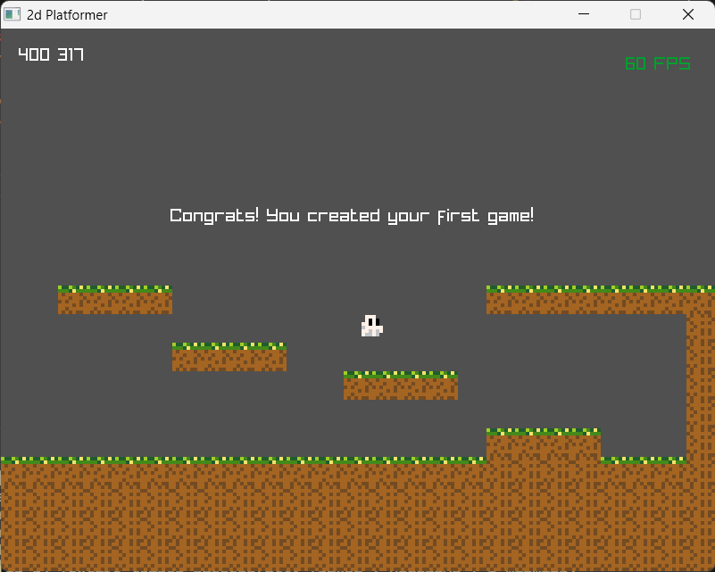

# 2D Platformer

Welcome to my 2D Platformer project  
**This project is currently under development...**  
I used the raylib game library to develop it in C.  

My goal with this particular project is the learn the basics of game architecture along with how things work in C language and working with makefiles.

## Quickstart
Currently, the makefile is only written to build for windows (It will be updated later)
### Windows
Enter the following command in the Parent directory:
```bash
make run
```