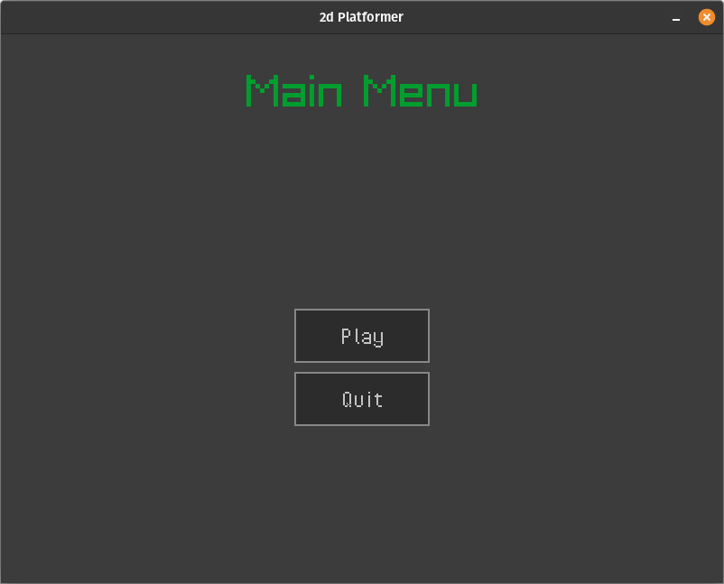
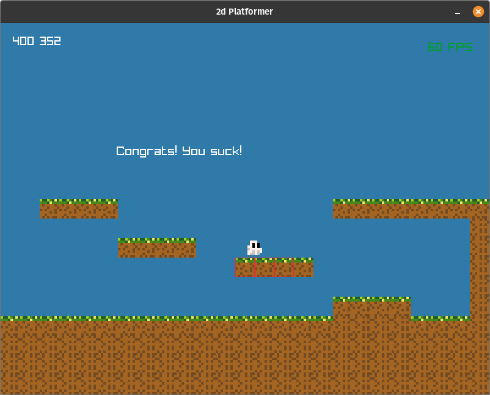

# 2D Platformer
  


Welcome to my 2D Platformer project  
**This project is currently under development...**  
I used the raylib game library to develop it in C.  

My goal with this particular project is the learn the basics of game architecture along with how things work in C language and working with makefiles.

## Quickstart
This project is now using CMake as its build system.  
To build and run the project,  
navigate to the root directory of the project and run the following commands in your terminal/shell:  

```shell
$ mkdir build
$ cd build
$ cmake ..
$ make run
```

Support for OSes other than linux is currently untested. On linux, raylib lib files must be present in your PATH. (installed on your system)
